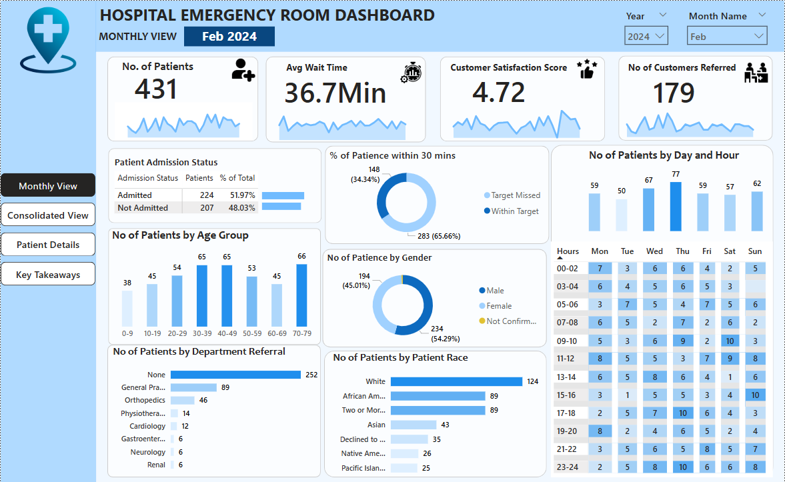

# Hospital Emergency Room Dashboard 📊  

This Power BI project provides a comprehensive analysis of emergency room performance, tracking key metrics such as patient volume, wait times, referrals, and satisfaction scores. The dashboard helps hospital administrators make data-driven decisions to enhance efficiency and patient care.

## 📸 Dashboard Preview  
  

## 🚀 Project Overview  

### 🎯 Business Requirements  
The dashboard was designed to analyze and visualize key hospital emergency room (ER) metrics, including:  
- **Total Number of Patients**: Daily ER visits with trend analysis.  
- **Average Wait Time**: Insights into patient wait durations before receiving care.  
- **Patient Satisfaction Score**: Trends in patient feedback on ER services.  
- **Number of Patients Referred**: Breakdown of referrals to other departments.  

### 📌 Key Performance Indicators (KPIs)  
This dashboard enables stakeholders to:  
✅ Monitor **daily trends** for patient visits and wait times.  
✅ Identify **peak hours and seasonal patterns** affecting ER efficiency.  
✅ Optimize **resource allocation** based on referral trends.  
✅ Track **patient demographics** to improve service delivery.  

## 📊 Dashboards Developed  

### 1️⃣ **Monthly View**  
- Tracks patient admissions and non-admissions.  
- Analyzes patient age distribution.  
- Monitors referrals to various hospital departments.  
- Assesses timeliness (patients seen within 30 minutes).  
- Provides insights into gender and racial demographics.  
- Displays patient volume by time of day.  

### 2️⃣ **Consolidated View**  
- Aggregates key ER metrics over a user-selected date range.  
- Provides a broader perspective on patient trends and operational efficiency.  

### 3️⃣ **Patient Details**  
- Displays individual patient records with relevant data fields:  
  - Patient ID, Full Name, Gender, Age, Admission Date, Race, Wait Time, Referral Department, and Admission Status.  

### 4️⃣ **Key Takeaways**  
- Summarizes findings across all dashboards.  
- Highlights patterns, anomalies, and actionable recommendations to improve ER efficiency.  

## 🛠️ Project Steps  

1. **Requirement Gathering**: Understanding business needs and KPIs.  
2. **Data Walkthrough**: Reviewing data structure and sources.  
3. **Data Connection**: Importing datasets into Power BI.  
4. **Data Cleaning & Quality Check**: Ensuring accuracy and consistency.  
5. **Data Modeling**: Structuring relationships between data tables.  
6. **Data Processing & DAX Calculations**: Creating calculated columns & measures.  
7. **Dashboard Layout & Charts Development**: Designing and formatting visuals.  
8. **Insights Generation**: Extracting meaningful trends and recommendations.   

## 📌 How to Use  
1. Download and open the **Power BI (.pbix) file**.  
2. Refresh the data connection if using a live dataset.  
3. Navigate through the different dashboards to explore insights.  

## 🤝 Contributing  
Feel free to **fork this repository** and submit pull requests for improvements or additional features!  

## 📩 Contact  
For any queries or collaborations, reach out to me via:  
📧 Email: [chidochashegerald@gmail.com]  

---

🔹 **Developed by [Zhou Chidochashe]**  
🔹 **Tools Used**: Power BI, DAX, Data Cleaning & Visualization  
